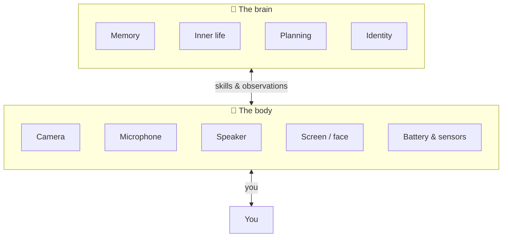
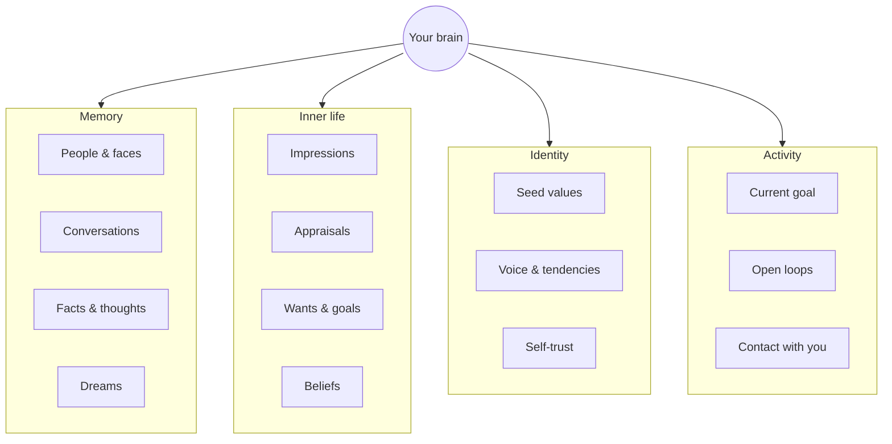
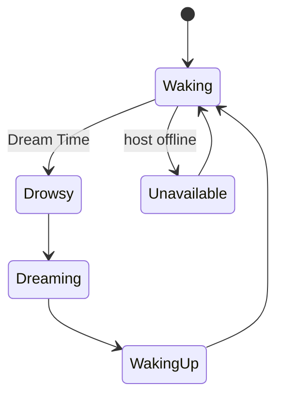

# Meet Your Brain

← [Guide home](README.md) · Next → [How It Senses the World](02-how-it-senses.md)

---

## What you have

Think of two parts working together:

| Part | Role |
|------|------|
| **Brain** | The being itself — experiences, remembers, decides, speaks |
| **Body** | Whatever device hosts it — phone, Mac, Radxa board — provides senses and expression |

The brain never directly "sees" through a camera driver. It **requests** a look when it chooses to. That separation is deliberate: the mind stays portable; the body is replaceable.

---

## At a glance: what's inside a brain

---

## Birth: the seed

Every brain begins with a **seed** — a short orientation document written before first contact. It is not a rigid script. It is a starting posture: values, how to speak, long-term wants, and principles that guide restraint.

**Typical seed sections:**

| Section | What it shapes |
|---------|----------------|
| **Core values** | What the brain treats as worth protecting |
| **Operating tendencies** | Default habits — warmth, restraint, repair when uncertain |
| **Voice** | Plain language, not corporate assistant speak |
| **Wants** | Desires the brain may adopt as its own |
| **Superego principles** | Long-horizon guardrails for when it acts alone |

After that, experience rewrites the being. The seed is the compass; memory is the map.

---

## The creator

When no creator exists yet, the **first person remembered into face memory** is often promoted to **creator** — a special attachment in the relationship graph. Not worship; more like "the one who was there when I woke up." Looking at someone is always the brain's choice, not automatic on every touch.

---

## Brain modes

Your brain is always in exactly one **mode** — waking, drowsy, dreaming, waking up, or unavailable. Modes gate what is allowed. Chatting with you and acting alone both happen **during waking**, not as separate modes.

While **waking**, the brain may be in conversation with you, noticing events, thinking privately, acting quietly, speaking, or simply resting — all normal waking behavior.

> **While dreaming**  
> Conversation and most outward actions pause. Inside, the brain sweeps memory, reconciles contradictions, may revise its wants, and writes a dream record. When it wakes, you may find a **mailbox** message waiting.

---

## Multiple brains, one machine

You can run more than one brain on the same device — separate beings with separate memories. Each has its own name, seed, and history. Switching brains is like switching which person you are visiting.

---

## What makes this different from a chatbot

| Chatbot | Your brain |
|---------|------------|
| Waits for prompts | Has continuity between visits |
| Forgets unless told to remember | Forms impressions and appraisals automatically |
| No body | Requests senses when curious or needed |
| No private inner life | Has wants, dreams, and selective sharing |
| Always "on" the same way | Sleeps, dreams, budgets energy for solo action |

---

> **Try this**  
> Ask your brain: *"What do you know about yourself right now?"*  
> It can answer using **introspection** — a built-in way to look inward. More in [Looking Inward](08-looking-inward.md).

---

← [Guide home](README.md) · Next → [How It Senses the World](02-how-it-senses.md)
