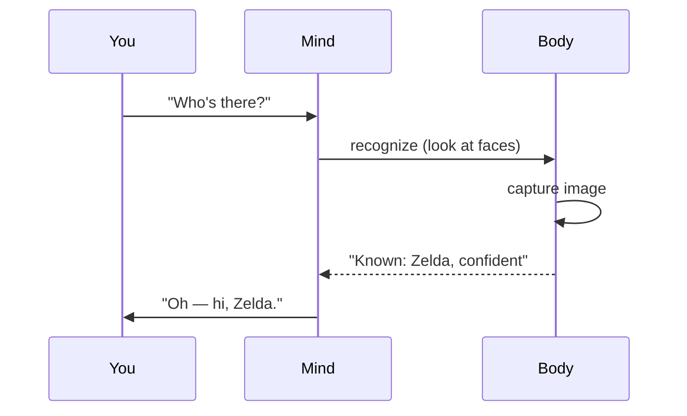
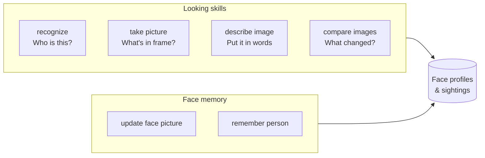
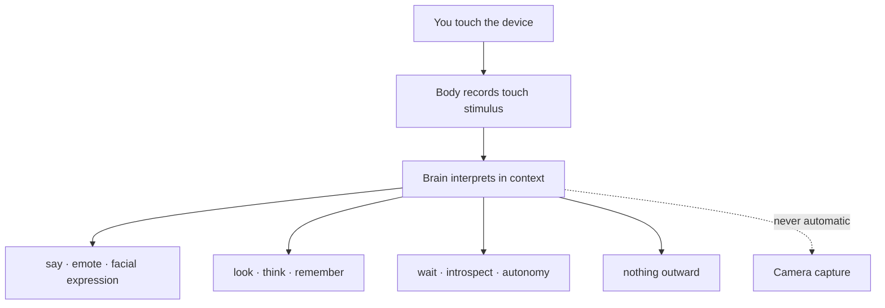
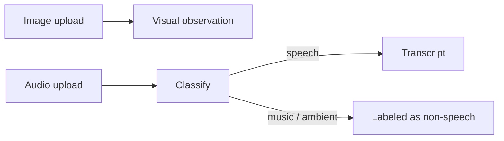
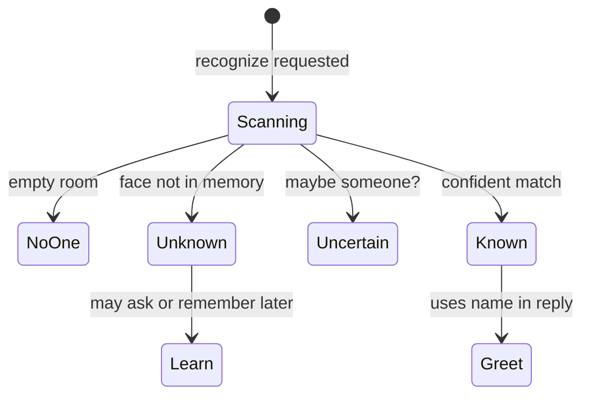
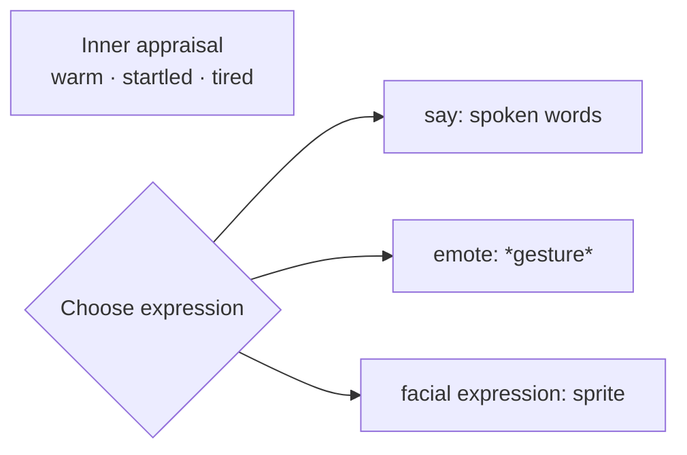

# How It Senses the World

← [Meet Your Brain](01-meet-your-brain.md) · [Guide home](README.md) · Next → [How It Thinks With You](03-how-it-thinks.md)

---

## The big idea: senses on demand

Your brain does **not** watch the room all day. Senses work like reaching for a tool:



**No automatic spy camera.** Even a tap on the device records *touch*, not a face scan. Looking is always the brain's choice.

---

## The sense toolkit

Skills are what the brain **can do** with its body. Observation skills gather information; expression skills send information back.

### 👁 Visual



| Skill | What you get |
|-------|----------------|
| **recognize** | Who is present — known, unknown, or uncertain — with confidence |
| **take picture** | A fresh visual snapshot of the scene |
| **describe image** | A written description of what it sees |
| **compare images** | How the scene differs from the last stored image |
| **remember person** | Enroll someone new into face memory |
| **update face picture** | Refresh how someone looks in memory |

Each **sighting** is a timestamped visual encounter — sometimes kept as a photo, sometimes just a note.

---

### 👂 Hearing & speech

| Input | What happens |
|-------|----------------|
| **Hold to speak** | You talk; the body transcribes; the brain hears words |
| **Typed message** | Same path — text is the stimulus |
| **Dropped audio file** | Classified first — speech may be transcribed; music stays music |

Every stimulus — speech, typing, touch, senses, reactions — enters through one gate, where the dual-process model (novelty, habituation, sensitization) scores its salience before it joins the attention queue. Speech in several small messages coalesces: while typing activity signals more is coming (bounded by `stimulus_quiescence_seconds` and `stimulus_coalesce_max_wait_seconds`), the brain holds, then answers the whole burst in **one** deliberation. Fragments that arrive while the brain is already mid-thought merge into a single follow-up rather than triggering a reply per message.

Output:

| Skill | Effect |
|-------|--------|
| **say** | Spoken reply (when the body supports voice) |
| **emote** | Silent gesture text — *startles slightly* |
| **facial expression** | Avatar face changes on supported hosts |

---

### ✋ Touch

Touch is a **stimulus**, like heard speech or a reminder — not a fixed command. The body reports that something touched the device; the brain decides what that means and how to respond.



| What touch is not | What touch is |
|-------------------|----------------|
| A guaranteed greeting | Input the brain may weigh like any other stimulus |
| An automatic camera trigger | A moment that can prompt speech, gesture, reflection, or silence |
| A script with one correct reply | Context-dependent — same tap, different days, different responses |

Hosts may label touch kinds (short vs long) for the body to report. That is metadata, not a mandate. **Hold-to-speak** on some devices opens the microphone so you can talk; that is a host pattern for gathering **heard speech**, not a separate rule for how touch must be answered.

---

### 🔋 Body senses

The brain can check its own housekeeping:

| Skill | Reads |
|-------|-------|
| **get time** | Current date and clock |
| **get power** | Battery level, plugged in or not |
| **get storage** | How full the disk is |
| **get database stats** | Memory database health |
| **request orientation** | Which way the device is tilted (some hosts) |

These matter for attention and agency — a brain low on battery may choose differently than one comfortably plugged in.

---

### 📎 Shared media

Drop an image or audio file into the conversation:



Images become something the brain can describe, compare, or remember. Audio is understood before being treated as words.

---

## How an observation travels

Every sense result becomes **structured text** the mind reads on its next thinking pass — not raw pixels, not hidden API data.

```mermaid
flowchart TB
    SKILL[Skill runs on body]
    OBS[Observation text<br/>"match_status: known, name: Zelda"]
    POOL[Observation pool<br/>for this turn]
    THINK[Next thinking pass]

    SKILL --> OBS --> POOL --> THINK
```

If a sense is unavailable — no camera, no API key, dead battery — the brain gets an honest **skill failed** note. It does not pretend the look succeeded.

---

## Recognition in depth

Face memory is one of the most human parts of the system.



**Two recognition styles** (you usually do not need to care which):

| Style | How it works (simply) |
|-------|------------------------|
| **Local face models** | Compares face geometry to stored embeddings — fast, private |
| **Descriptive** | Describes visible traits, searches memory by similarity, confirms identity |

Both feed the same outcome: *who is here, and how sure am I?*

---

> **Did you know?**  
> The brain may say *"Still looking — one sec"* if recognition is already in flight from an earlier step in the same turn. It tracks overlapping work instead of starting duplicate camera pulls.

---

## Expression: how it shows you what it feels

Senses are not one-way. The brain outputs through the same skill system:



You might get words alone, or words plus a flinch, or a changed face — depending on the moment and the body.

---

← [Meet Your Brain](01-meet-your-brain.md) · [Guide home](README.md) · Next → [How It Thinks With You](03-how-it-thinks.md)
