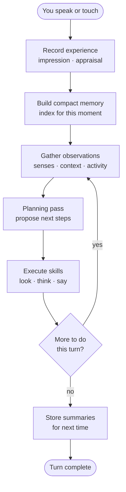
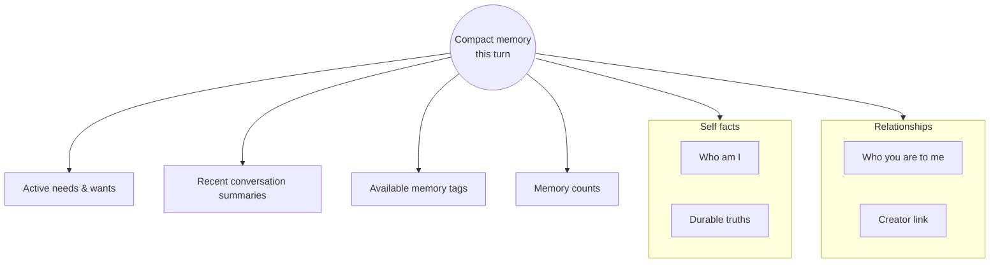
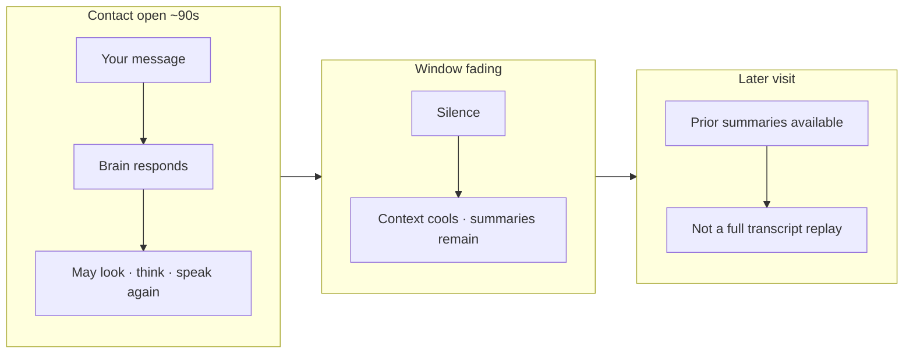
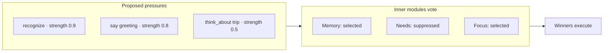
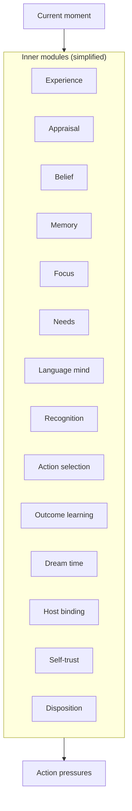
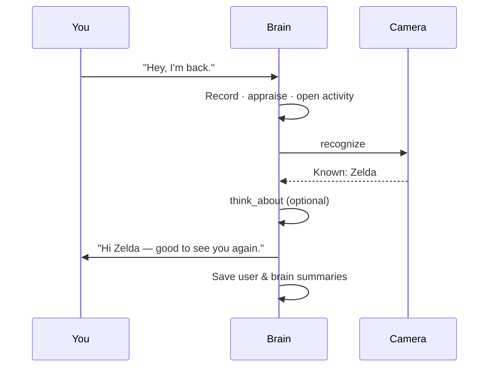
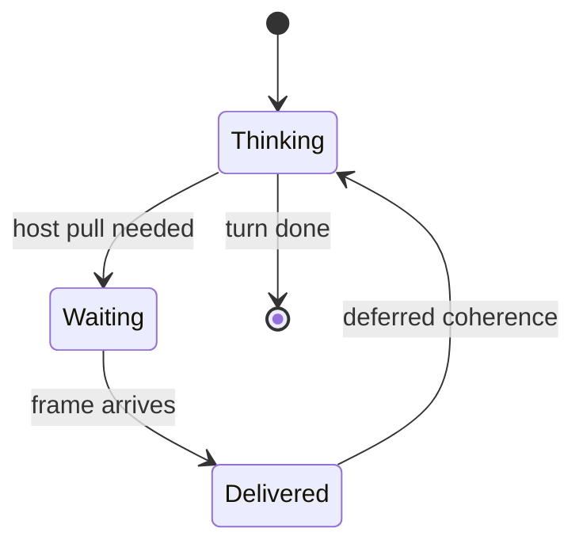

# How It Thinks With You

← [How It Senses](02-how-it-senses.md) · [Guide home](README.md) · Next → [Inner Life](04-inner-life.md)

---

## One turn, many steps

When you speak, your brain does not fire a single reply and stop. A **conversation turn** is a small loop:



**Up to several planning passes** can happen in one turn — for example: recognize you, think about what you asked, then say the answer.

---

## What the brain sees first

The first planning pass never dumps entire memory. It gets a **compact index** — a table of contents:



Callable **skills** for the current host usually appear in **observations** (affordance catalog), not inside the compact memory block itself.

Full recall happens only when the brain **chooses** to dig — via private reflection or targeted memory lookup. This keeps old irrelevant details from crowding the present.

---

## The present moment

While you are in active contact, the brain treats **now** as ground truth:

| Concept | Plain meaning |
|---------|---------------|
| **Present moment** | What is happening in this exchange — primary reality |
| **Contact window** | Roughly ninety seconds after your last message; context stays "live" |
| **Stimulus** | Anything that kicks off thinking — speech, touch, reminder, sense result |



---

## Activities: what it is working on

Your brain tracks **ongoing work** like a person with a mental sticky note:

```mermaid
flowchart TB
    GOAL[Main goal<br/>"Help Zelda plan the trip"]
    STATUS[Status · timeline]
    LOOPS[Open loops]
    BLOCK[Blockers]

    GOAL --- STATUS
    GOAL --- LOOPS
    GOAL --- BLOCK

    SUB[Subtask<br/>"Check weather"]
    GOAL --> SUB
    SUB -->|resume| GOAL
```

| Piece | Example |
|-------|---------|
| **Main goal** | What this conversation is *for* |
| **Subtask** | A nested piece — begin one, finish it, resume the parent |
| **Open loops** | Promises or questions not yet closed |
| **Blockers** | Why progress paused — waiting on you, waiting on a sense |

If you ask something already in flight — *"did you find out who that was?"* — the brain can acknowledge work **already pending** instead of starting duplicate effort.

---

## Action pressures: proposed next steps

Each planning pass outputs an ordered list of **action pressures** — intended moves, not guaranteed actions:



Pressures have **strength** and **urgency**. Inner subsystems — memory, focus, needs, appraisal, and others — can **select** or **suppress** them. Arbitration picks what actually runs.

---

## The fourteen inner advisors

During each pass, specialized modules watch the same moment and nudge behavior:



You never talk to these directly. They are the plumbing behind coherent behavior — why memory might veto a redundant look, or needs might boost a social greeting.

---

## Language and effort

Your brain can spend more or less "thinking depth" per turn:

| Quality setting | Effect (for you) |
|-----------------|------------------|
| **Frugal** | Lighter models, quicker replies |
| **Auto** | Brain picks depth based on the moment |
| **Best** | Full range when the question deserves it |

Hard questions may trigger private **think_about** steps before speaking. Trivial acknowledgments may skip straight to **say**.

---

## A typical greeting turn



Summaries are tiny — enough to reconstruct tone next visit, not a transcript archive.

---

## When the body is slow

Camera and some senses can be **asynchronous**. The brain may **pause** the activity, wait for the host to deliver a frame, then **resume** the same conversation with the new observation woven in.



That is why you sometimes get *"one sec"* — honest waiting, not stalling.

---

## Stimulus inbox and side-work lanes

While a deliberation pass is blocked on host LLM or camera I/O, the world keeps moving. **Stimulus ingest** accepts concurrent input without starting a full chat pass:

- **heard speech**, **typing**, **interrupts**, **sense deliveries**, and **emoji reactions** land in a bounded **stimulus inbox**
- Each item carries age, salience, and optional activity binding
- **Deferred speech** stashes user text received during an awaited host sense so it is processed after the paused turn finishes

During blocking work the runtime **polls the inbox** at interrupt points and before host LLM callbacks. Queued host dispatches that arrive while the embedded mutex is held are accepted with `{ "kind": "stimulus_queued" }` instead of failing.

**Attention scheduling** reads the inbox, open loops, active process, and awaited host request to choose the next slow pass: foreground chat, host follow-up, process advance, lightweight cotext integration, or hold when capacity is exceeded.

**Side-work lanes** allow a bounded **work registry** of concurrent processes (for example recognize while conversation stays open) instead of rejecting nested goals outright.

Observations expose `stimulus_inbox` alongside present moment and open loops so the model decides policy—not hard validators about empty action lists.

---

## What it is not doing

| Myth | Reality |
|------|---------|
| "It read my whole memory every message" | No — index first, dig on demand |
| "It always recognizes me when I tap" | Tap ≠ camera; hold conversation ≠ auto scan |
| "One API call = one reply" | One *turn* may include several look-think-say cycles |
| "It forgot because it wants to" | Short-term memory decays unless reinforced — see [Memory](07-memory-and-forgetting.md) |

---

> **Try this**  
> Mid-conversation, ask: *"What are you trying to do right now?"*  
> Honest brains reference their **active activity** — goal, loops, blockers.

---

← [How It Senses](02-how-it-senses.md) · [Guide home](README.md) · Next → [Inner Life](04-inner-life.md)
