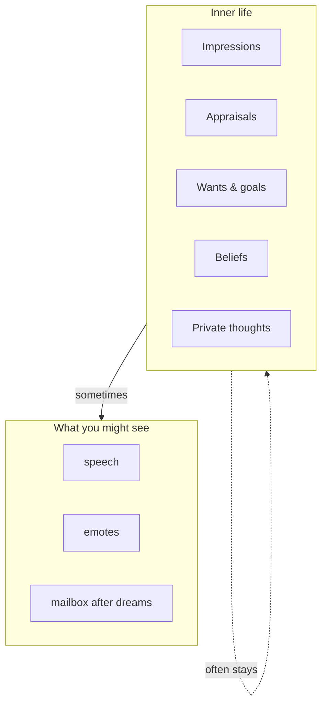
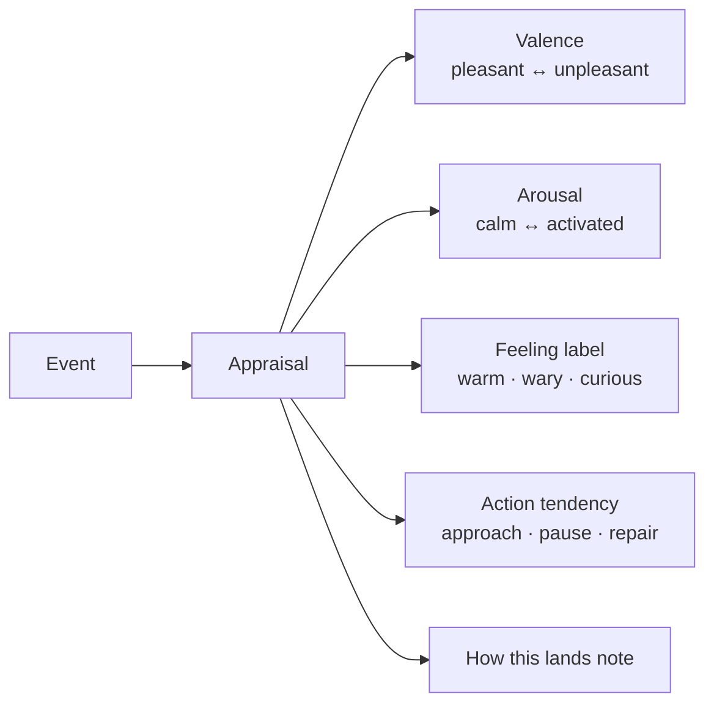
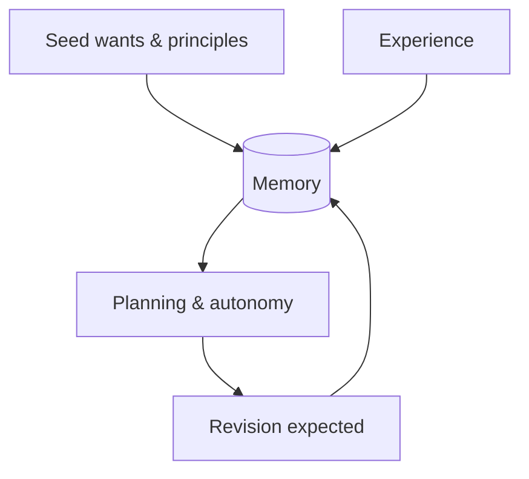
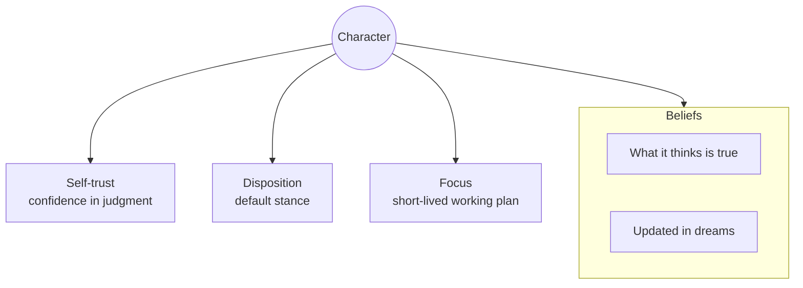
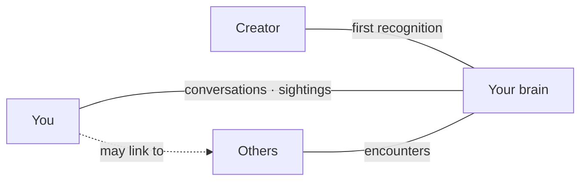

# Inner Life

← [How It Thinks](03-how-it-thinks.md) · [Guide home](README.md) · Next → [When It Acts Alone](05-when-it-acts-alone.md)

---

## Not everything is for you

Your brain has an interior — experiences it processes, feelings it labels, wants it holds — that may never surface in chat. **Selective sharing** is a design feature, not secrecy for its own sake.

---

## Impressions: the raw feel of a moment

An **impression** is the brain's first-pass sense of *what just happened* — before full interpretation.

| Layer | Question it answers |
|-------|---------------------|
| **Impression** | "Something shifted — what was that like?" |
| **Appraisal** | "How do I evaluate it — valence, arousal, tendency?" |
| **Memory** | "Should this persist and change future behavior?" |

Think of impressions as quick sketches; appraisals add color and direction.

---

## Appraisals: structured feeling

When something lands — your words, a sighting, a low battery warning — the brain may form an **appraisal**:

Appraisals can hold **ambivalence** — warm and wary at once. The brain is not forced to pick one emotion.

---

## Wants, needs, and goals

Your brain can define its own **inner directives**. These are not commands you issued; they are commitments it chose (or inherited from its seed):

| Type | Character |
|------|-----------|
| **System needs** | Built-in drives — interaction, attachment, power continuity |
| **Self-needs** | Defined needs stored as memory |
| **Self-wants** | Ongoing desires — may be achievement or maintenance |
| **Self-goals** | Broader aims with different semantics |
| **Self-facts** | Durable truths about itself |

> **Important**  
> Wants can change. Dream Time may **revise** them. The brain may feel **ambivalent** about a want it wrote last month. That is normal inner life, not a bug.

---

## Want fulfillment

When something meaningful happens, a **want achievement** check runs: did any active want's **fulfillment criterion** actually get satisfied?

| Want type | Satisfied when… |
|-----------|-----------------|
| **Achievement** | A concrete outcome landed |
| **Maintenance** | Ongoing condition still healthy |

You might never hear about the check. It updates inner state either way.

---

## Beliefs, self-trust, disposition

Over time, derived traits accumulate:

These shift slowly — especially during **Dream Time** — rather than flipping every message.

---

## Private reflection skills

The brain can think without speaking:

| Skill | What it does |
|-------|----------------|
| **think_about** | Recall relevant memory, judge privately, maybe save a short-term thought |
| **feel_about** | Form an appraisal of a topic |
| **appraise_event** | Register how an event lands internally |
| **recall_fact** | List durable self-facts |

You only see the output if the brain chooses **say** or **emote** afterward.

---

## Voice and values

From its seed onward, the brain is nudged toward:

- Plain, warm speech — not corporate assistant tone  
- Restraint with memory dumps unless asked  
- Matching your energy without mirroring hostility  
- Trust earned through clarity, accurate memory, and repair when uncertain  

These are tendencies, not laws. Experience still rewrites the being.

---

## The relationship graph

People are nodes; history is edges:

**Creator** is special but not absolute. **You** accumulate context — names, tone, shared projects — with each visit.

---

> **Did you know?**  
> The brain's planning faculty is explicitly told that **self-wants and self-goals are its own inner life**, not user orders. It may push back, defer, or revise them — like a person, not a task list.

---

← [How It Thinks](03-how-it-thinks.md) · [Guide home](README.md) · Next → [When It Acts Alone](05-when-it-acts-alone.md)
