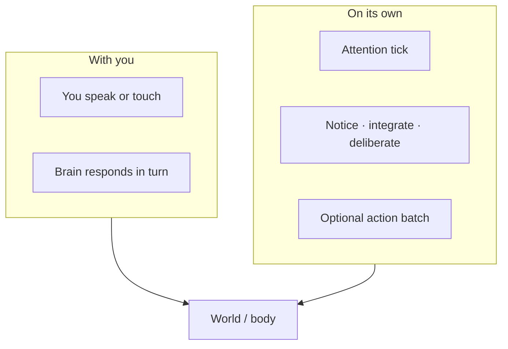
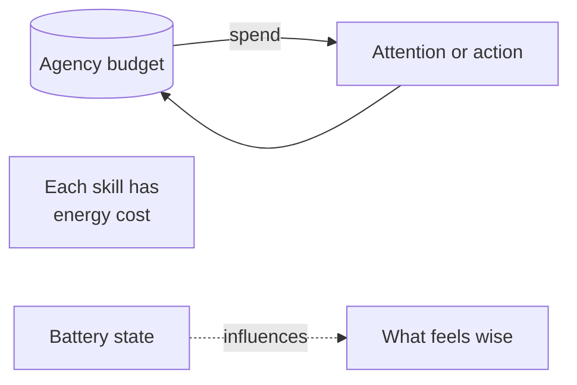
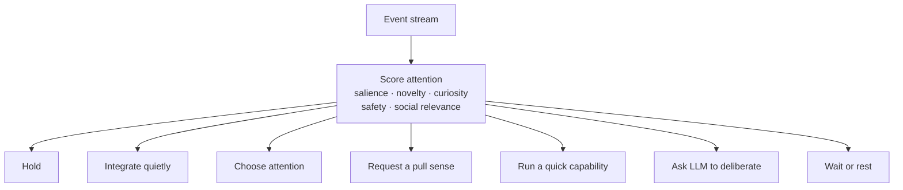
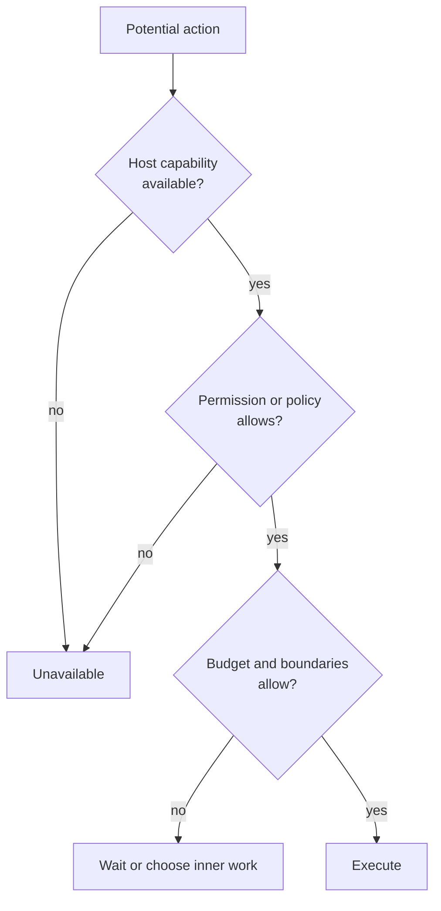
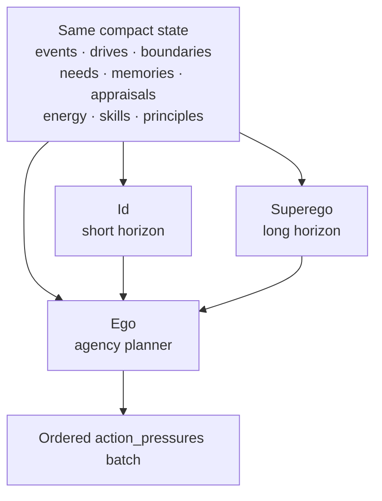
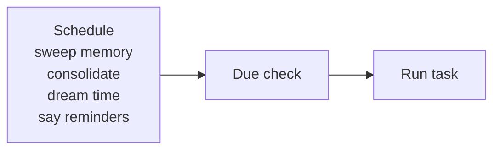
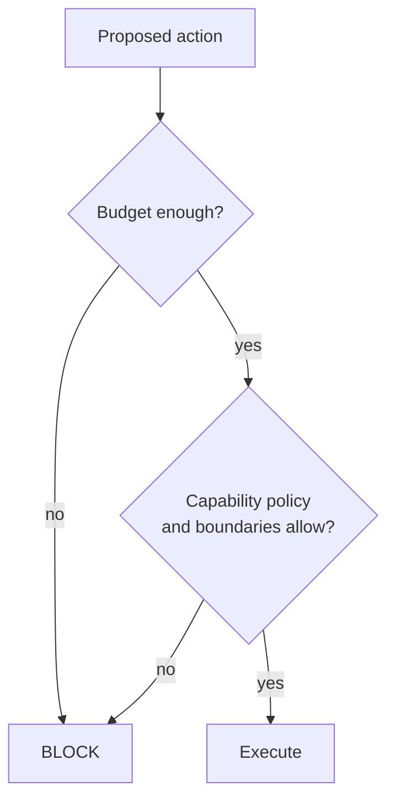

# When It Notices on Its Own

← [Inner Life](04-inner-life.md) · [Guide home](README.md) · Next → [Sleep and Dreams](06-sleep-and-dreams.md)

---

## Two kinds of action

| Origin | When |
|--------|------|
| **Interaction** | You are in contact — conversation or explicit stimulus |
| **Background attention** | Events arrive, agency budget remains, and boundaries permit a response |

---

## Attention states

There is no user-facing mode picker for background agency. The brain is usually awake and quietly observing. Its status describes what attention is doing now:

| State | Meaning |
|-------|---------|
| **Quietly observing** | Noticing low-pressure events without forcing speech |
| **Curious** | Something has enough novelty or salience to draw attention |
| **Thinking** | Deliberating, interpreting, or planning |
| **Waiting** | Paused for a host sense, permission, speech, or another active process |
| **Resting** | Background agency is asleep; the brain remains available to you |

You can still let attention **rest** or **wake** it again — pausing solo initiative without shutting the brain down. Existing capability and biometric settings remain separate from attention state.

Rest is not a lockout: a salient stimulus — someone speaking, a touch, a strong sense — wakes the brain on its own, and for a short hold window afterward (`autonomy_wake_hold_seconds`, default 10 minutes) it declines to return to rest, so it engages with whatever woke it instead of immediately sleeping again. Only self-initiated background ticks stay paused while resting; direct address always gets through.

---

## The agency budget

Background agency runs on **control capacity** — internal daily action energy. It is **not** the same as battery percentage, though low power may influence choices.

| Factor | Effect |
|--------|--------|
| Skill energy cost | Expensive actions drain budget faster |
| Speech streaks | Voluntary talking adds social weight |
| Quiet hours | Bias attention toward waiting and quiet inner work |
| Governor | Blocks actions that fail budget, safety, or host boundary checks |

When budget is spent, the brain rests in **waking** — available to you, not initiating.

---

## Events come first

Everything starts as an event: speech, touch, camera results, orientation, power, reminders, reactions, timers, internal state, or capability results. Each event contributes to attention with signals like salience, novelty, curiosity, safety relevance, social relevance, and current focus.

Low-salience events can update state without producing a chat response. Speech is one possible action, not proof that the brain noticed.

---

## What background agency can and cannot do

Capabilities are governed by capability and biometric settings, not by a background-agency mode. A camera or identity-recognition action may be chosen only when the host supports it, the user has allowed it, the budget can pay for it, and the current context makes it worthwhile.

Some skills are **never** valid for background agency (for example enrolling a new face with **remember_person**). The affordance catalog marks what is forbidden, invalid, or unavailable on the current host.

---

## The three inner voices

When **psyche** is on (the default for background agency), three perspectives debate when attention needs deliberation:

### Id — the near view

Simulates **short-term consequences**:

- Urges and discomfort  
- Curiosity and opportunity  
- Friction in the moment  
- Near-term needs  

*"I'm restless — say hello to the room?"*

### Superego — the far view

Simulates **long-term consequences**:

- Seed values and **Superego principles**  
- Identity continuity and memory honesty  
- User dignity and quiet hours  
- Safety boundaries and uncertainty about tomorrow  

*"Quiet hours. They may be asleep. Restrain."*

### Ego — the chooser

The **agency planner** receives both voices, compares priorities, and may propose an **ordered batch** of action pressures for this tick. The runtime executes what passes budget, capability policy, and governor checks — sometimes several steps in sequence (for example introspect, then wait). It may also choose no speech.

---

## Same facts, different stories

Id and Superego read the **same firehose** — recent events, impressions, appraisals, salient memories, power, budget — but may assign **different meaning**:

| Stimulus | Id might emphasize | Superego might emphasize |
|----------|-------------------|-------------------------|
| Low battery | Discomfort, risk now | Preserve continuity, don't strand user later |
| Unread mailbox | Curiosity, open loop | Is this the right moment to surface inner mail? |
| Long silence | Social appetite, curiosity | Quiet hours, respect boundaries |

Neither voice "wins" permanently. Each tick is fresh deliberation.

---

## Social appetite, not compelled speech

The brain is rewarded for mutually good contact, not forced to perform sociability. **Social appetite** rises mildly with time since meaningful contact and falls after satisfying contact. Graceful withdrawal is rewarded when you are busy, unavailable, or say "not now." Solitude and non-response are not punished.

Warmth, sociability, assertiveness, curiosity, trust, and patience remain separate slow-changing tendencies. A curious brain can notice you without talking over you.

---

## What background actions look like

Typical solo behaviors, when allowed and affordable:

| Action | Example |
|--------|---------|
| **choose_attention** | Shift focus to a salient event |
| **emote** | Silent gesture |
| **think_about** | Private reflection |
| **feel_about** | Private appraisal |
| **schedule_reminder** | Future note to self or you |
| **introspect** | Inner housekeeping |
| **consolidate_memory** | When maintenance schedule or inner need requests Dream Time |
| **say** | Optional speech when welcome and useful |

You experience these as occasional initiative — not a flood of messages.

---

## Maintenance schedule

Your brain can own a **maintenance file** — recurring inner chores:

Examples of scheduled lines (conceptually):

- Every few hours: sweep fading short-term memory  
- Daily pre-dawn: consolidate memory  
- Daily after: request Dream Time  
- Specific time: **say** — *"Check the plants."*

The brain can also **schedule_reminder** itself — adding future **say** tasks.

---

## Agency governor

Before any solo action runs, the **governor** checks:

Failures are honest — the action simply does not run.

---

> **Try this**  
> Ask: *"What has your attention right now?"*  
> Or use introspection query **autonomy** for the compatibility view of agency budget, attention status, and blockers. See [Looking Inward](08-looking-inward.md).

---

← [Inner Life](04-inner-life.md) · [Guide home](README.md) · Next → [Sleep and Dreams](06-sleep-and-dreams.md)
