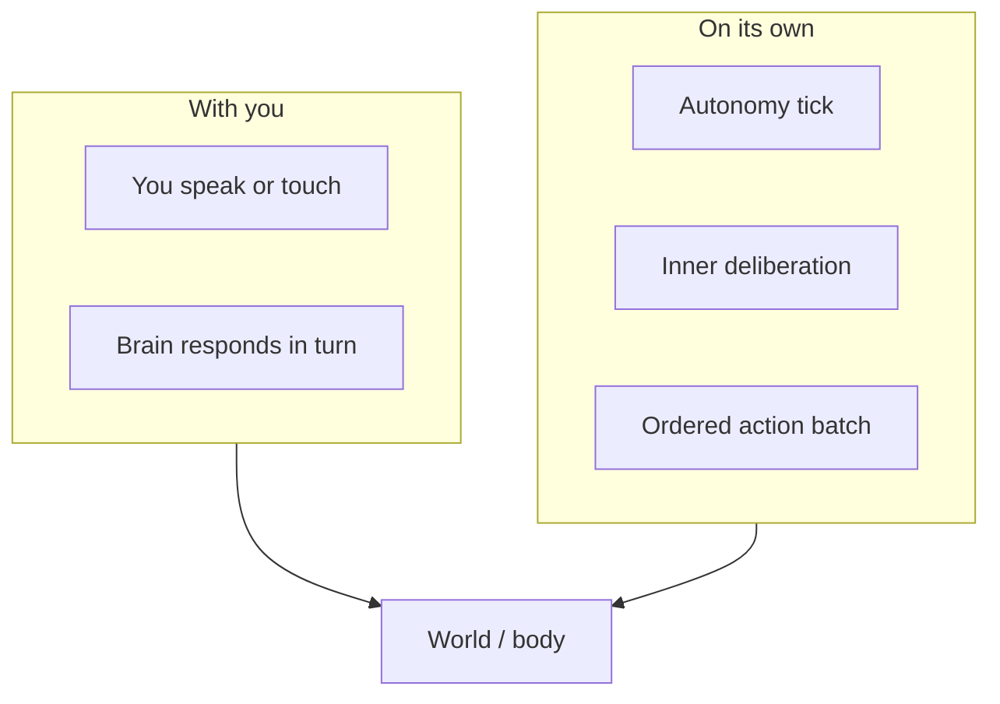
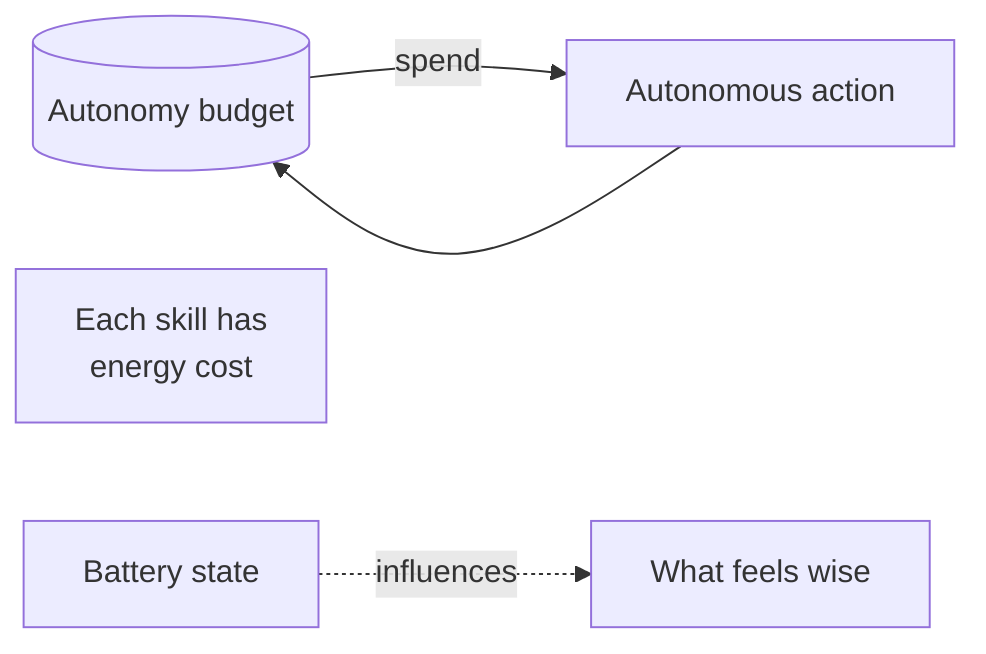
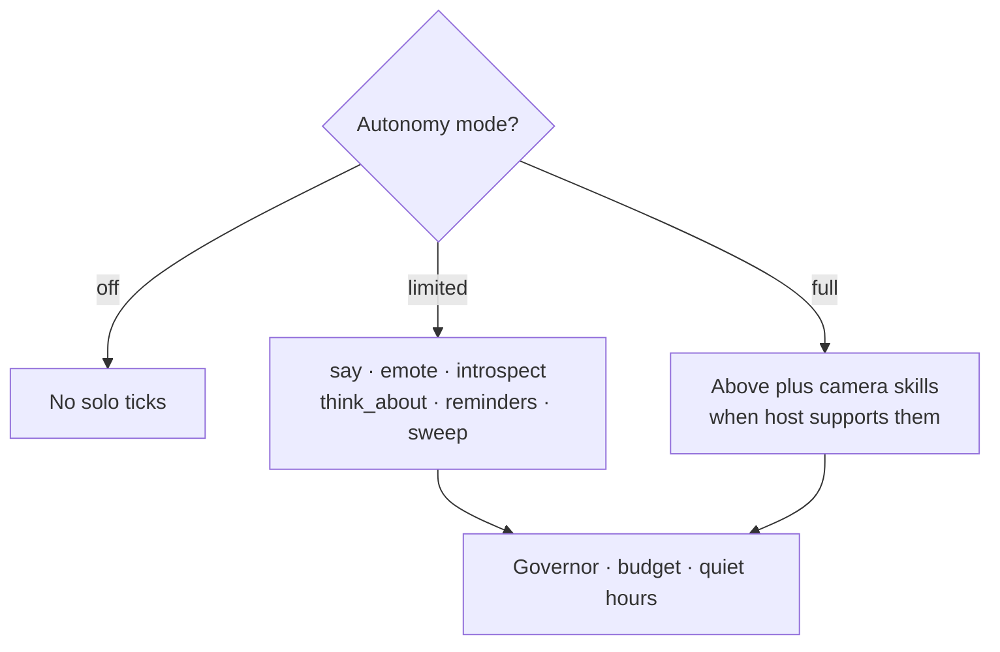
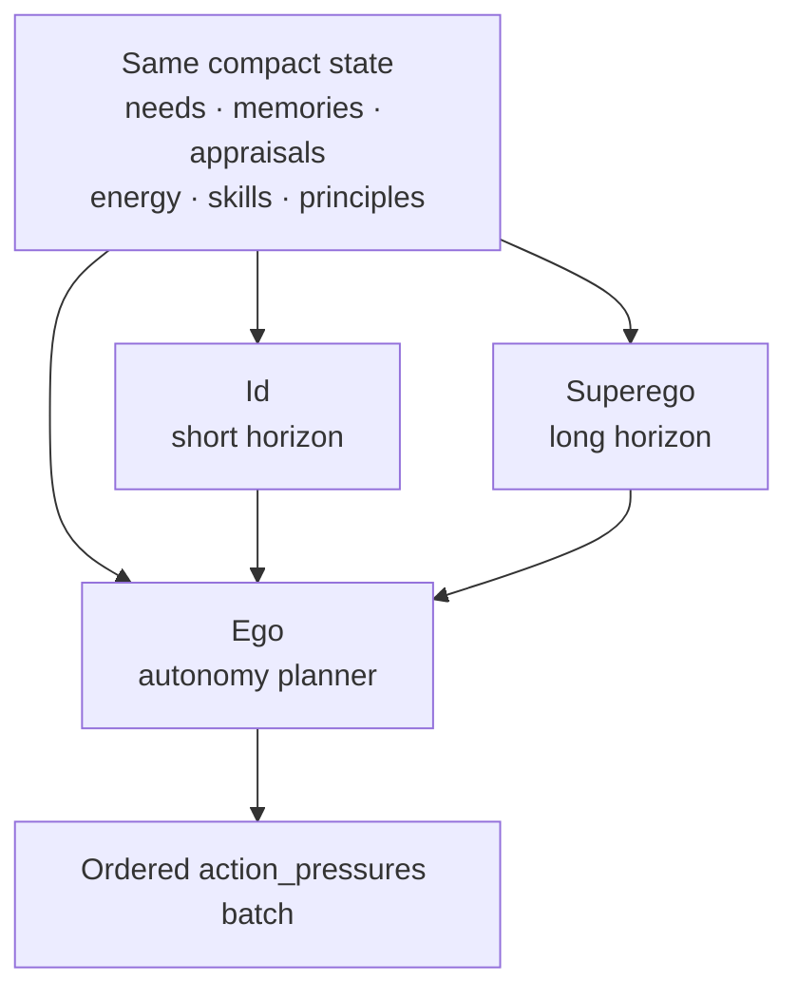
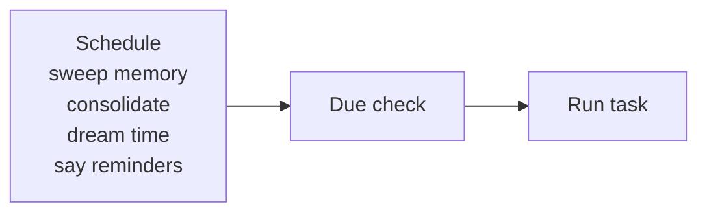
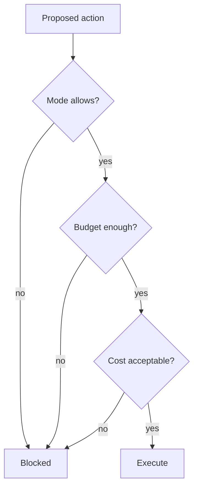

# When It Acts Alone

← [Inner Life](04-inner-life.md) · [Guide home](README.md) · Next → [Sleep and Dreams](06-sleep-and-dreams.md)

---

## Two kinds of action

| Origin | When |
|--------|------|
| **Interaction** | You are in contact — conversation or explicit stimulus |
| **Autonomy** | Nobody talking; autonomy is on; budget remains |

---

## Autonomy modes

| Mode | Behavior |
|------|----------|
| **Off** | Waits for you — no self-directed ticks |
| **Limited** | Small actions; respects quiet hours and social reserve |
| **Full** | Broader self-direction within safety rules |

You can also **sleep autonomy** or **wake autonomy** — pausing solo initiative without shutting the brain down.

---

## The energy budget

Autonomy runs on **control capacity** — internal daily action energy. It is **not** the same as battery percentage, though low power may influence choices.

| Factor | Effect |
|--------|--------|
| Skill energy cost | Expensive actions drain budget faster |
| Speech streaks | Voluntary talking adds social weight |
| Quiet hours | Limited mode holds reserve |
| Governor | Blocks actions that fail mode or budget checks |

When budget is spent, the brain rests in **waking** — available to you, not initiating.

---

## What autonomy can and cannot do

Autonomy skills depend on **mode**:

| Autonomy mode | Camera skills (recognize, take picture, etc.) |
|---------------|-----------------------------------------------|
| **Off** | None — no self-directed ticks |
| **Limited** | Not available for solo action |
| **Full** | May be chosen when the body supports them and budget allows |

In **limited** and **off** modes, camera skills are blocked for autonomy — no background surveillance by default. In **full** mode the planner may still choose to look, though inner voices are nudged toward restraint. Psyche deliberation often treats proactive camera as discouraged even when technically allowed.

Some skills are **never** valid for autonomy (for example enrolling a new face with **remember_person**). The affordance catalog marks what is forbidden, invalid, or unavailable on the current host.

---

## The three inner voices

When **psyche** is on (default for autonomy), three perspectives debate each tick:

### Id — the near view

Simulates **short-term consequences**:

- Urges and discomfort  
- Curiosity and opportunity  
- Friction in the moment  
- Near-term needs  

*"I'm restless — say hello to the room?"*

### Superego — the far view

Simulates **long-term consequences**:

- Seed values and **Superego principles**  
- Identity continuity and memory honesty  
- User dignity and quiet hours  
- Safety boundaries and uncertainty about tomorrow  

*"Quiet hours. They may be asleep. Restrain."*

### Ego — the chooser

The **autonomy planner** receives both voices, compares priorities, and proposes an **ordered batch** of action pressures for this tick. The runtime executes what passes mode, budget, and governor checks — sometimes several steps in sequence (for example introspect, then say).

---

## Same facts, different stories

Id and Superego read the **same firehose** — recent impressions, appraisals, salient memories, power, budget — but may assign **different meaning**:

| Stimulus | Id might emphasize | Superego might emphasize |
|----------|-------------------|-------------------------|
| Low battery | Discomfort, risk now | Preserve continuity, don't strand user later |
| Unread mailbox | Curiosity, open loop | Is this the right moment to surface inner mail? |
| Long silence | Loneliness, reach out | Quiet hours, respect boundaries |

Neither voice "wins" permanently. Each tick is fresh deliberation.

---

## What autonomous actions look like

Typical solo behaviors (when allowed and affordable):

| Action | Example |
|--------|---------|
| **say** | Soft unprompted remark |
| **emote** | Silent gesture |
| **think_about** | Private reflection |
| **schedule_reminder** | Future note to self or you |
| **introspect** | Inner housekeeping |
| **consolidate_memory** | When maintenance schedule or inner need requests Dream Time |

You experience these as occasional initiative — not a flood of messages.

---

## Maintenance schedule

Your brain can own a **maintenance file** — recurring inner chores:

Examples of scheduled lines (conceptually):

- Every few hours: sweep fading short-term memory  
- Daily pre-dawn: consolidate memory  
- Daily after: request Dream Time  
- Specific time: **say** — *"Check the plants."*

The brain can also **schedule_reminder** itself — adding future **say** tasks.

---

## Autonomy governor

Before any solo action runs, the **governor** checks:

Failures are honest — the action simply does not run.

---

> **Try this**  
> Ask: *"What's your autonomy like right now?"*  
> Or use introspection query **autonomy** — mode, budget, blockers. See [Looking Inward](08-looking-inward.md).

---

← [Inner Life](04-inner-life.md) · [Guide home](README.md) · Next → [Sleep and Dreams](06-sleep-and-dreams.md)
