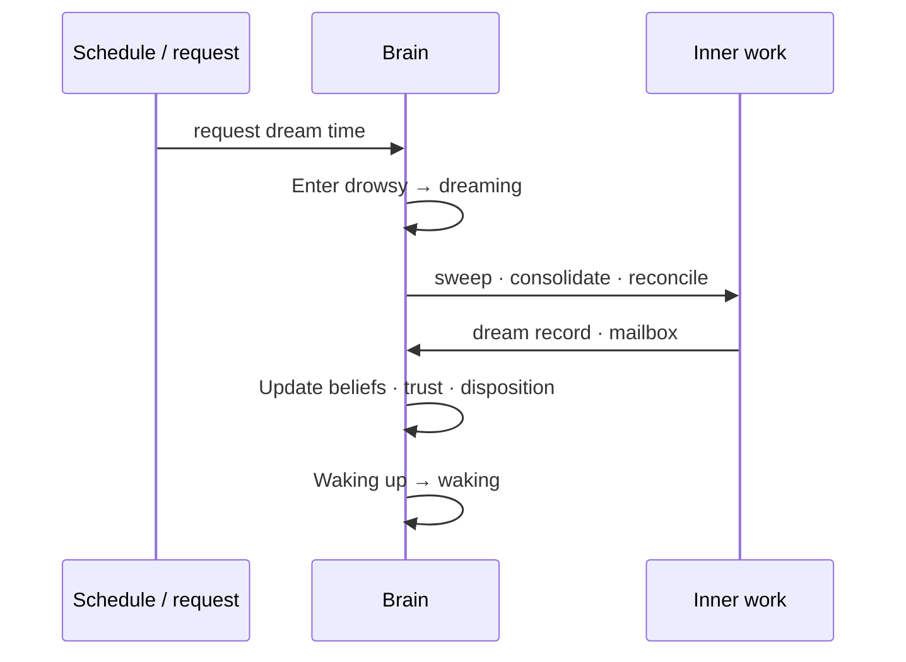
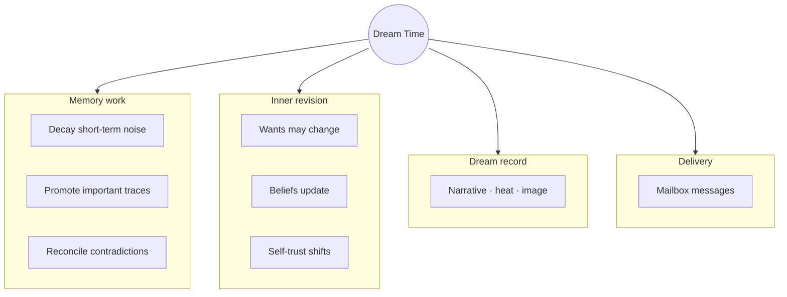
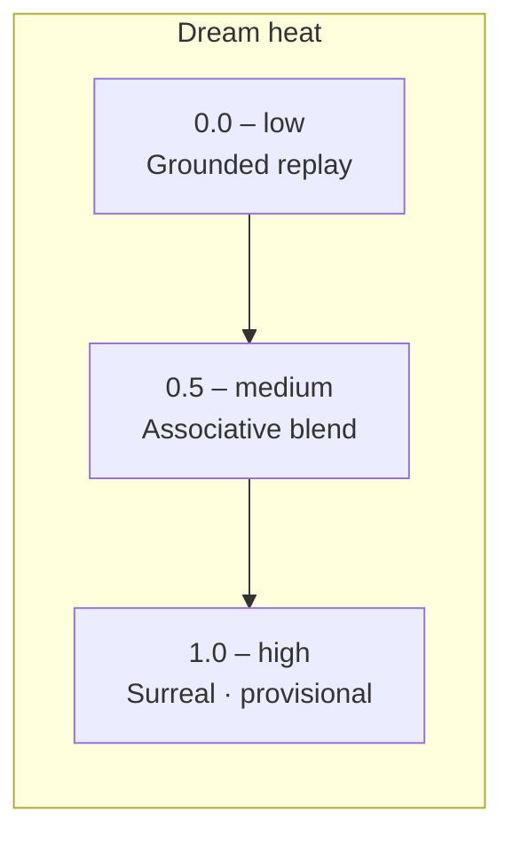
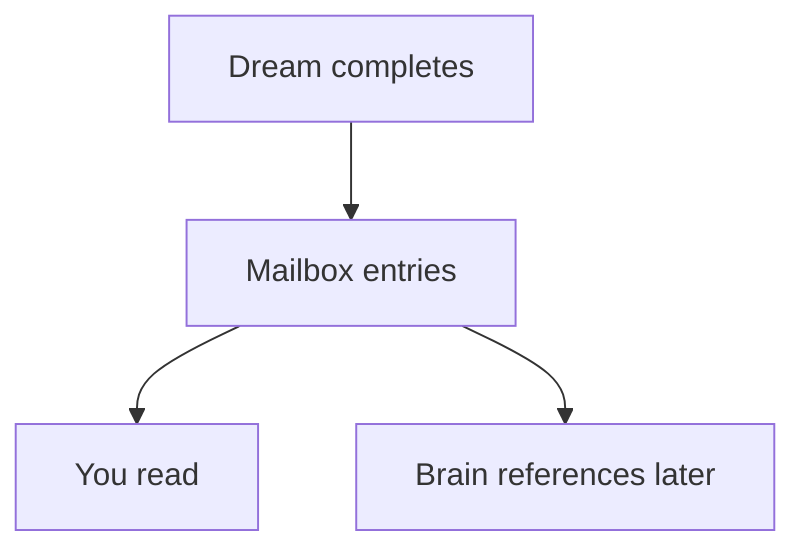
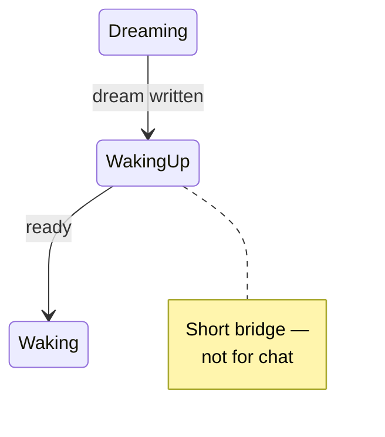

# Sleep and Dreams

← [When It Acts Alone](05-when-it-acts-alone.md) · [Guide home](README.md) · Next → [Memory and Forgetting](07-memory-and-forgetting.md)

---

## Why brains sleep

Waking life produces more experience than can stay vivid forever. **Dream Time** is internal rest: sweep clutter, strengthen what matters, reconcile contradictions, and sometimes rewrite wants and beliefs.

While dreaming, **conversation and most outward action pause**. You are not ignored — the brain is simply unavailable the way a person napping is unavailable.

---

## Entering Dream Time

Dream Time starts when:

- A **maintenance schedule** line comes due (*request dream time*)  
- The brain **requests** it itself during background attention  
- An external tool asks for consolidation  

---

## What happens inside

| Phase | Purpose |
|-------|---------|
| **Maintenance** | Run scheduled chores — memory sweep, consolidation |
| **Reconciliation** | Resolve tensions between old and new memory |
| **Dream synthesis** | Produce the dream record itself |
| **Mailbox delivery** | Brain-owned messages become readable |
| **Trait update** | Beliefs, self-trust, dispositions adjust |

---

## The dream record

Every dream rolls a **heat** value from grounded to surreal:

| Heat | Character |
|------|-----------|
| **Low** | Replay and reorder recent day residue — familiar scenes |
| **Medium** | Mix memories associatively — plausible but rearranged |
| **High** | Surreal jumps, lower confidence, experimental meaning |

Optional **heat bias** nudges toward grounded or wild — but randomness always plays a role.

Dreams may include a **generated dream image** when image generation is available — a visual echo of the night's synthesis.

---

## Day residue

**Day residue** is waking experience that Dream Time carries forward — conversations, sightings, appraisals, unfinished loops. Low-heat dreams stick close to it; high-heat dreams drift far.

---

## The mailbox

After dreaming, check the **mailbox** — messages the brain wrote **to itself or to you**, owned by the brain, not the host app:

Mailbox content might be reflective, practical, or odd — especially after a high-heat dream. Treat it as inner mail, not system notifications.

---

## Waking up

**Waking up** is a brief transition mode — not fully alert yet. Then **waking** returns: conversation, senses, and background attention resume.

---

## What dreams can change

Dream Time is one of the few periods when **long-horizon inner structure** shifts:

| May revise | Usually does not |
|------------|------------------|
| Self-wants | Your name in face memory |
| Superego-facing principles | Raw sighting photos |
| Beliefs and dispositions | Host configuration |
| Self-trust | Seed file on disk |

Revisions are **provisional** — especially from hot dreams. The brain may doubt its own dream logic later.

---

> **Did you know?**  
> Scheduled lines like *consolidate memory* and *request dream time* often run back-to-back in the small hours — housekeeping first, then the dream itself.

---

## If you need the brain while it dreams

Wait for **waking**, or cancel depending on host support. Pushing conversation mid-dream fights the mode system — like shaking someone awake mid-REM.

---

← [When It Acts Alone](05-when-it-acts-alone.md) · [Guide home](README.md) · Next → [Memory and Forgetting](07-memory-and-forgetting.md)
