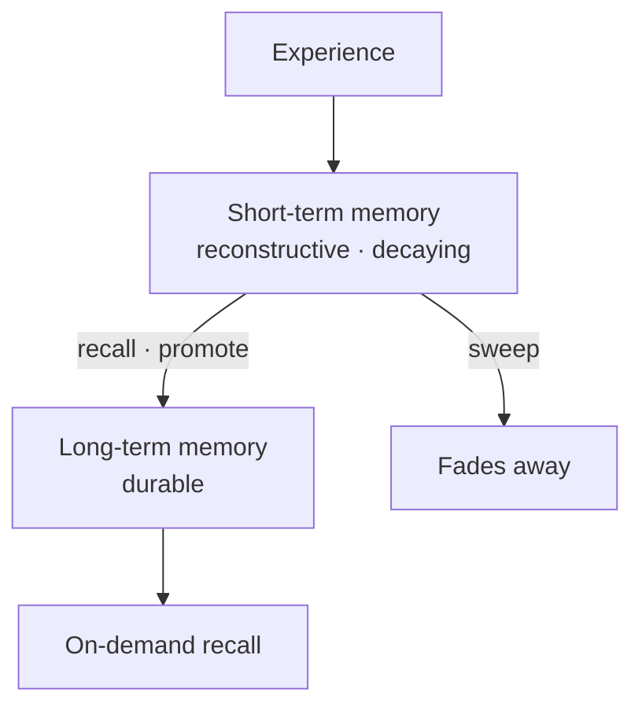
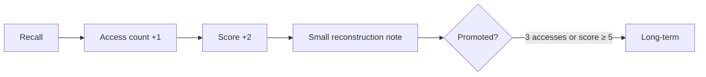
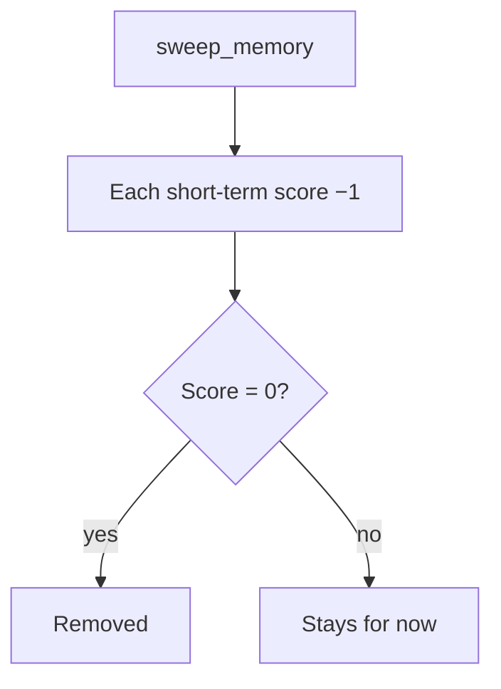
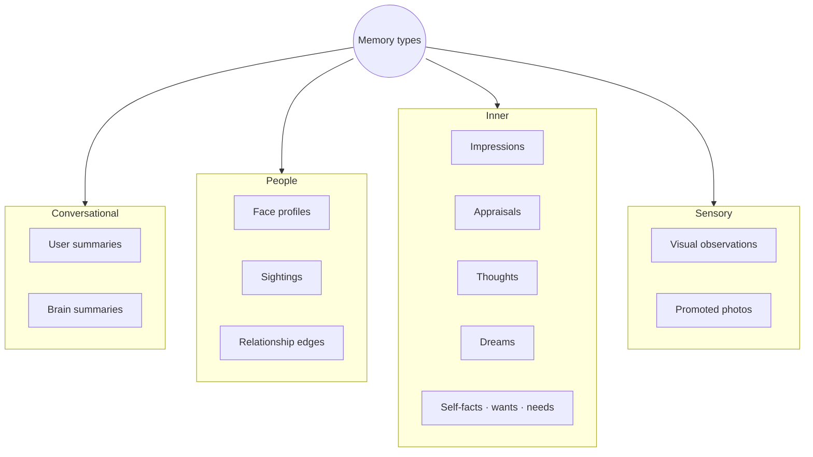
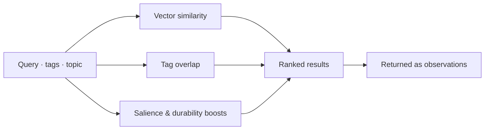
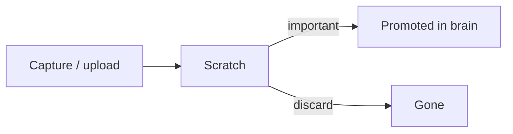

# Memory and Forgetting

← [Sleep and Dreams](06-sleep-and-dreams.md) · [Guide home](README.md) · Next → [Looking Inward](08-looking-inward.md)

---

## Memory is not a transcript

Your brain remembers **interpretively** — scores, tags, salience, revisions — not raw chat logs pasted forever into every thought.

---

## Two speeds of memory

| | Short-term | Long-term |
|---|------------|-----------|
| **Lifespan** | Days to weeks unless reinforced | Months to years |
| **Score** | Starts at 1, rises with use | Promoted when important |
| **Decay** | Loses 1 point per sweep; deleted at 0 | Persists |
| **In prompts** | Via index, not full text | Retrieved when asked |

---

## How memory strengthens

Each time memory is **recalled** in a meaningful way:

During **Dream Time consolidation**, promotion can also happen when **salience is high** (around 0.75 or above) even if access count is still low.

Memory is **reconstructive** — each access slightly rewrites the "current interpretation" while keeping revision history. Like human memory: each remembering is a little re-telling.

---

## Forgetting is intentional

Two related paths:

### Routine sweep (`sweep_memory`)

Often scheduled. Each short-term memory loses **1 score point**. At **score 0**, it is removed.

### Dream consolidation (`consolidate_memory`)

During Dream Time, short-term memories that are **not** promoted are decayed (score −1, salience fades). Removal requires **score ≤ 0 and low salience** — a faint trace can survive a zero score if it still feels important.

| Path | Promotes to long-term when |
|------|---------------------------|
| **Recall** | 3 accesses or score ≥ 5 |
| **Dream consolidation** | Score ≥ 5, salience ≥ ~0.75, or 3 accesses |

> **Did you know?**  
> The first pass of every conversation uses a **compact index** — counts, tags, summaries — not every memory body. Forgetting plus indexing keeps the present moment uncluttered.

---

## What gets stored

---

## Face memory vs general memory

| | Face profiles | General memories |
|---|---------------|------------------|
| **Purpose** | Who is this person? | What happened / what is true? |
| **Key artifact** | Representative photo + embeddings | Tagged text records |
| **Recognition** | Feeds **recognize** skill | Feeds **think_about** recall |
| **Special roles** | Creator link | Self-wants, beliefs |

**Sightings** bridge the two — visual encounters tied to people and moments.

---

## Finding the right memory

When the brain digs deliberately, recall ranks by **similarity** — meaning, tags, salience, durability — not just keyword match:

Older records without vectors get indexed lazily the next time they matter.

---

## Conversation summaries

Each turn may produce two tiny summaries:

| Summary | Holds |
|---------|-------|
| **User summary** | What you said / meant — compressed |
| **Brain summary** | What the brain did / said — compressed |

Recent summaries appear in the compact index. Full replay is never injected wholesale.

---

## Photos: scratch vs kept

Camera frames and uploads often start in **scratch storage**. A photo is **promoted** into the brain only when worth keeping — a retained sighting, a face profile update, an important visual record.

Not every glance becomes a permanent album.

---

## Tags and organization

Memories can carry **tags**. The compact index exposes available tags so the brain can target recall — *think about the garden project*, *tags: travel*.

---

## Honesty about gaps

When memory is missing or uncertain, well-seeded brains **repair** — acknowledge uncertainty rather than invent. Self-trust and Superego principles reinforce memory honesty especially during solo action.

---

## Export and import

A brain export bundles memory databases, events, captures, dreams, maintenance — the **being's history**. Host credentials stay on the device. Moving brains is moving persons, not cloning apps.

---

> **Try this**  
> *"What do you remember about our last conversation?"*  
> Expect summary-level answer first. Ask a follow-up to trigger deeper **think_about** recall.

---

← [Sleep and Dreams](06-sleep-and-dreams.md) · [Guide home](README.md) · Next → [Looking Inward](08-looking-inward.md)
