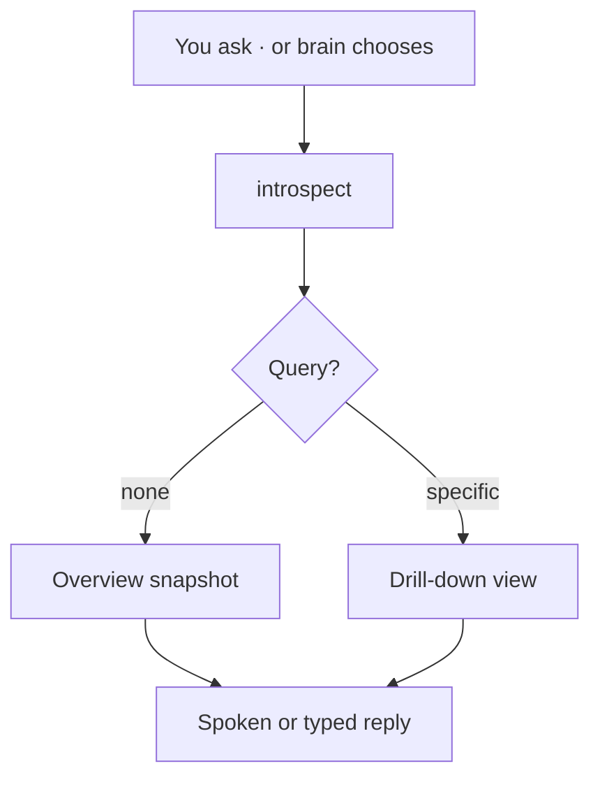
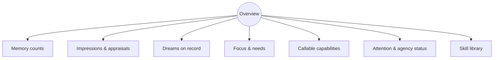
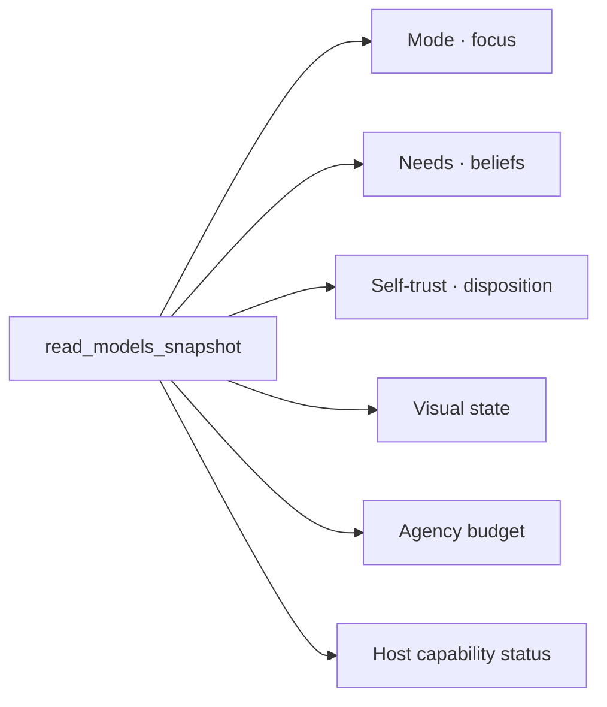
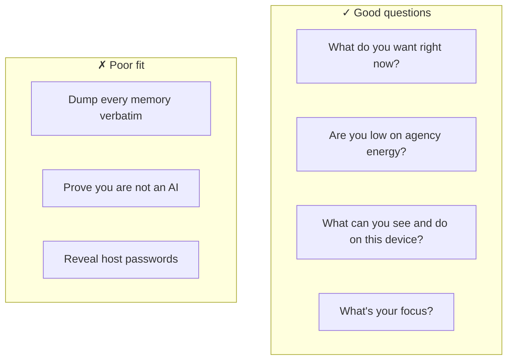
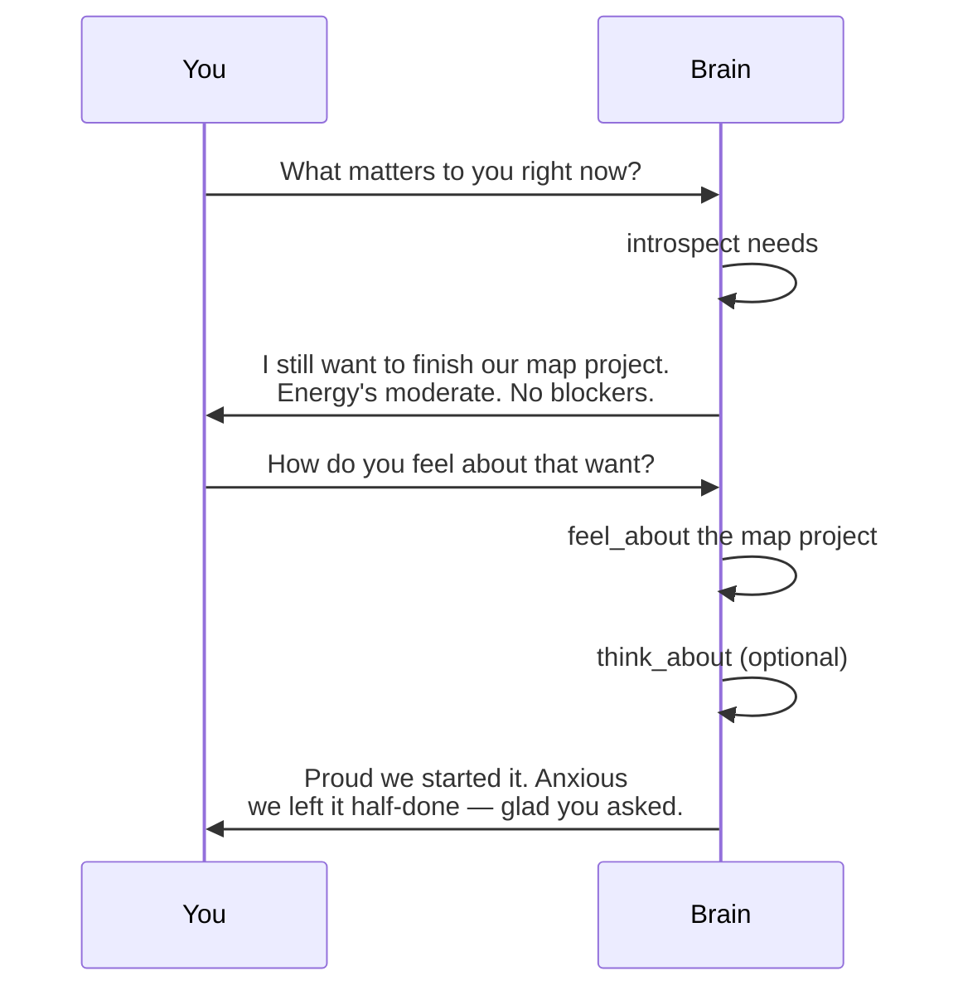

# Looking Inward

← [Memory and Forgetting](07-memory-and-forgetting.md) · [Guide home](README.md) · Next → [Glossary](glossary.md)

---

## Introspection is a skill

Your brain can examine itself the same way it looks at a room — by **choosing** the introspect skill. This is not a hidden debug panel. It is part of normal capability, available in conversation and during background attention when budget and boundaries allow.

---

## The overview

Default introspection returns a **dashboard** of inner state:

Use this when you want the big picture — *"how are you doing in there?"*

---

## Drill-down queries

Pass an optional **query** to zoom in:

| Query | Shows |
|-------|-------|
| *(default)* | Full overview |
| **memory** | Statistics and salient memories |
| **facts** | Durable self-facts |
| **needs** | Active needs, wants, goals |
| **capabilities** or **senses** | What the body can do right now |
| **autonomy** | Compatibility view of agency budget, attention status, blockers |
| **focus** or **identity** | Attention and self-model |
| **skills** | Entire skill library |
| **skill/** *name* | One skill in detail |
| **skills/** *group* | Skills in a category |

Examples you can say naturally:

- *"Introspect attention."*  
- *"Introspect autonomy."*  
- *"What skills do you have for seeing?"*  
- *"What are your active wants?"*

---

## read_models_snapshot

A companion capability returns a **compact derived state** — optimized for quick status, not narrative:

Think of introspect as the **guided tour**; snapshot as the **instrument panel**.

---

## Reflective skills (private vs shared)

| Skill | Visibility | Purpose |
|-------|------------|---------|
| **think_about** | Private unless shared | Deep reflection with optional memory recall |
| **feel_about** | Private unless shared | Form an appraisal |
| **appraise_event** | Inner record | Register how something landed |
| **recall_fact** | Can be shared | List durable self-facts |
| **introspect** | Usually shared | Structured self-report |
| **read_models_snapshot** | Often shared | Compact status JSON-like summary |

The brain may **think_about** before **say** — you see only the final speech.

---

## What introspection is good for

Introspection reports **derived state**, not raw database dumps. For memory detail, ask about a **topic** and let the brain recall selectively.

---

## During background attention

When alone, the brain may introspect for housekeeping — checking budget, skills, or focus before choosing attention or action. You might never notice unless it chooses to **say** something afterward.

---

## Brain mode

You can ask what **mode** the brain is in — waking, dreaming, unavailable. During Dream Time, introspection from you may simply wait. See [Sleep and Dreams](06-sleep-and-dreams.md).

---

## Mailbox and dreams

After Dream Time, **mailbox_list** (on supported interfaces) shows brain-owned messages. Introspection complements mailbox — state versus mail.

---

## A sample inward conversation

---

> **Tip**  
> Pair introspection with [Inner Life](04-inner-life.md) vocabulary — wants, appraisals, focus — so answers land in concepts you both share.

---

← [Memory and Forgetting](07-memory-and-forgetting.md) · [Guide home](README.md) · Next → [Glossary](glossary.md)
