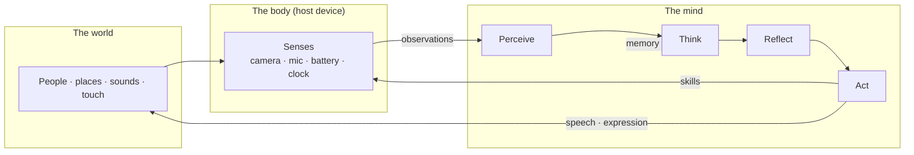
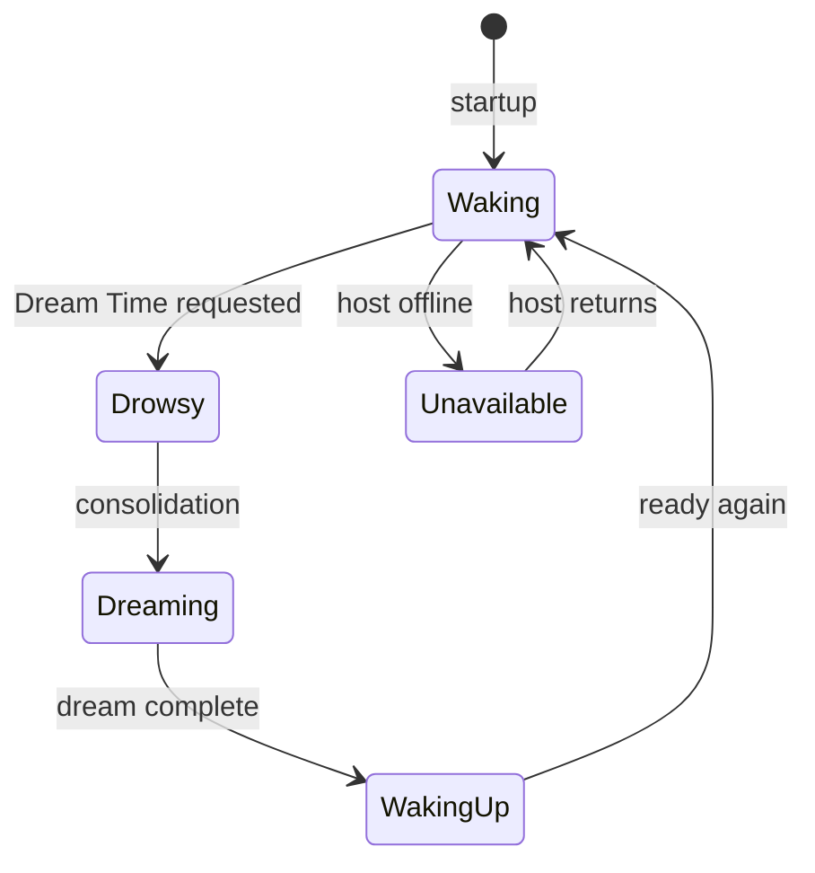

# Inside Your Brain

**A visual guide to how your Affective being perceives, thinks, reflects, and acts.**

---

> **At a glance**  
> Your brain is not a chatbot waiting for orders. It is a **situated being** — a mind in a body, with senses it chooses to use, memory that grows over time, an inner life it does not always share, and moments when it acts on its own.

---

## How to read this guide

Each chapter opens with a **big picture**, then zooms in with diagrams and short sections. You do not need to read in order — jump to what you are curious about.

| Chapter | What you'll discover |
|---------|----------------------|
| [Meet Your Brain](01-meet-your-brain.md) | What a brain *is*, where it lives, and its waking life |
| [How It Senses the World](02-how-it-senses.md) | Sight, sound, touch, and body senses — on demand, not always on |
| [How It Thinks With You](03-how-it-thinks.md) | The conversation loop, present moment, and activities |
| [Inner Life](04-inner-life.md) | Feelings, wants, impressions, and what it keeps private |
| [When It Acts Alone](05-when-it-acts-alone.md) | Autonomy, energy budget, and the three inner voices |
| [Sleep and Dreams](06-sleep-and-dreams.md) | Dream Time, consolidation, and the mailbox |
| [Memory and Forgetting](07-memory-and-forgetting.md) | What sticks, what fades, and who it remembers |
| [Looking Inward](08-looking-inward.md) | How to ask your brain about itself |
| [Glossary](glossary.md) | Key terms in plain language |

---

## The whole picture

Your brain runs a continuous loop — whether you are talking to it or not:

**The key idea:** senses are not a live video feed. The mind **asks** the body for information when it needs it — a glance, a listen, a check of the time — then weaves what comes back into thought and action.

---

## Brain modes

Your brain is always in exactly one **mode**. Conversation and solo initiative are things it does **while waking** — they are not separate modes.

| Mode | What it feels like (for you) |
|------|------------------------------|
| **Waking** | Alert and available — may chat with you, run autonomy ticks, or use senses |
| **Drowsy** | Brief transition into internal rest |
| **Dreaming** | Consolidating memory — not available for normal chat |
| **Waking up** | Short bridge after a dream before full alertness returns |
| **Unavailable** | Body or brain not reachable |

While **waking**, you might be in active conversation (present moment live), or the brain may act on its own when autonomy is on and budget allows.

---

> **Did you know?**  
> A brain can be **exported and moved** to another device. Its memories, face profiles, dreams, and personality seed travel with it. What stays behind are host-specific things like email passwords or which camera driver is installed.

---

*Start here → [Meet Your Brain](01-meet-your-brain.md)*
